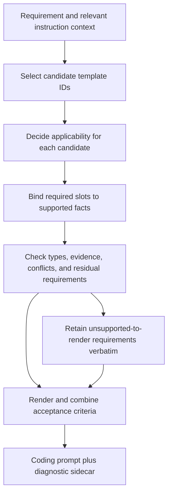

# Acceptance criteria templates: catalog and selection proposal

Date: 2026-10-08

Status: research proposal; no production pipeline changes

Scope: requirements after routing and splitting → acceptance criteria → coding prompt

## 1. Recommendation

Build a catalog of **verification patterns with typed parameters**, rendered as concise prose. A template should describe a particular kind of observable promise, such as “each entry creates a fresh value,” “an override wins at the nearest scope,” or “an error in one stream item does not prevent later items.” It should also state when it applies and what evidence is required to fill it.

Use **multiple templates per requirement**. Start with a model selecting from short descriptions of the whole catalog, then filling the selected templates from the instruction and relevant context. Do not start with a large decision tree or an embedding index. Compare those alternatives on the same examples before adding them.

The recommended initial catalog below has **52 templates**. It is a starting vocabulary, not a claim that all software requirements fit these forms. A requirement without a suitable template must remain in the coding prompt; a catalog miss must never silently remove work or block headless prompt creation.

Three things must be correct separately:

1. **Selection:** choose every applicable verification pattern, without choosing unrelated ones.
2. **Binding:** fill its conditions, operations, observations, and expected outcomes faithfully.
3. **Composition:** preserve all requested behavior in the final prompt without repeating it or strengthening it beyond the instruction.

Templates make these decisions more explicit and reusable. They do not eliminate the need to understand English.

## 2. What counts as a good acceptance criterion?

A **requirement** states a requested property or behavior. An **acceptance criterion** states an observable condition that must hold for that requirement to be satisfied. A **test** is one executable way to check that condition. These are related but not interchangeable.

For example:

> Requirement: State accepts a data keyword mapping string keys to default values. On entry, data initializes as a fresh copy of the defaults.

An inadequate criterion is “State supports data mappings.” It leaves the interface and the resulting behavior vague. A better set is:

- `State` accepts the `data` keyword with a dictionary whose keys are strings.
- When a state declared with `data={"count": 0}` is entered, `get_state_data(state)["count"]` is `0`.
- Assigning a new value to that active data mapping does not change the declaration's defaults.

The example value `0` is illustrative. The property applies to valid declarations generally. This does **not** assert recursive copying of nested mutable values: the instruction's “fresh copy” does not establish that depth.

### Quality gates

| Gate | What the criterion must establish | Common failure |
| --- | --- | --- |
| Faithful | Every mandated behavior follows from the instruction or authorized context | Adding a default, exception type, deep-copy guarantee, or API absent from the source |
| Observable | A named public result, state, callback, artifact, or explicitly requested structural property can be inspected | “Handles correctly,” “supports,” “robust,” “works as expected” |
| Decidable | The expected value, relationship, allowed set, or predicate is specified | “Returns appropriate errors” without identifying which errors or conditions |
| Scoped | The actor, object, phase, input class, and quantifier are clear where they affect behavior | Per instance confused with global; once per retry confused with once per logical request |
| Discriminating | A plausible incorrect implementation would fail the criterion | Deep and shallow history checked only in a hierarchy where they behave identically |
| Honest about uncertainty | Missing information remains unspecified, rather than acquiring an invented answer | “Reject both” becoming “require exactly one” |
| Complete as a set | Every requested branch, exception, relationship, and integration surface is represented | Correct happy-path criterion with omitted error continuation |
| Economical | Each behavioral assertion appears once; shared setup can be stated once | The same validation rule repeated under interface, behavior, and acceptance headings |

An individual criterion usually expresses one predicate. Several predicates may share a setup, table, or short scenario in the final prompt. A criterion does not have to use literal Given/When/Then wording.

The observable boundary is the API being built. A public library method or callback is a valid boundary. If the instruction explicitly requires exports, inheritance, annotations, or file placement, inspection is also a valid verification method; those requirements cannot all be reduced to runtime outputs.

### Research informing this design

- **Cucumber:** its scenarios separate setup, action, and observable outcome; examples can instantiate a general rule. That is useful rendering guidance, but Gherkin syntax alone cannot make an unspecified outcome precise. [Gherkin reference](https://cucumber.io/docs/gherkin/reference/)
- **NASA:** verification can use testing, analysis, inspection, or demonstration against requirements. This supports retaining explicit interface and structural obligations alongside behavioral checks. [Product Verification](https://www.nasa.gov/reference/5-3-product-verification/)
- **Property Specification Patterns:** reusable properties have parameters and temporal scopes. “An event eventually causes a response” is different from “a response requires an earlier event”; neither automatically means one distinct response per event. This is a strong precedent for separating the predicate from scope and cardinality. [Pattern notes](https://matthewbdwyer.github.io/psp/patterns/notes.html), [Response pattern](https://matthewbdwyer.github.io/psp/patterns/response.html)
- **Hypothesis:** stateful testing generates action sequences and can compare an implementation with a simpler model. Lifecycle and concurrency criteria need sequences and invariants, not merely isolated input/output examples. [Stateful testing](https://hypothesis.readthedocs.io/en/latest/stateful.html)
- **Sentence Transformers:** retrieval followed by reranking is an established way to narrow a candidate collection. It supplies an option for catalog search, not evidence that a retrieved template logically applies to a requirement. [Retrieve and rerank](https://sbert.net/examples/sentence_transformer/applications/retrieve_rerank/README.html)
- **NIST:** combinatorial coverage provides a way to describe coverage of interacting input factors. It can help choose additional examples after required branches have been covered; it cannot replace explicit cases required by the instruction. [Combinatorial coverage](https://csrc.nist.gov/pubs/journal/2016/12/measuring-specifying-combinatorial-coverage-test-i/final)

## 3. DeepSWE evidence and limits

The local corpus contains 114 task instruction files. This proposal draws on **12 complete instructions**, patch structure, and selected solution and validation hunks. It does not claim exhaustive patch review or execution of these tasks. The [evidence manifest](acceptance-criteria-template-evidence.json) records the artifact paths and hashes used for this research.

All paths below are relative to `~/code/powdrr-deep-swe/tasks/`. Each task has `instruction.md`, `solution/solution.patch`, and `tests/test.patch`. Patch line references below refer to lines in the patch file, not lines in the patched repository.

| Key | Task directory | Verification distinctions exposed by the task |
| --- | --- | --- |
| SM | `python-statemachine-state-data-scoping` | Constructor argument, per-instance ownership, callback visibility, reentry, deep versus shallow history, invalid argument combinations |
| GQL | `gql-incremental-graphql-delivery` | Accumulated data versus per-payload extensions, path merges, indexed stream items, control-only emissions, continuation after errors |
| LC | `langchain-request-coalescing` | Input equivalence, overlap in time, fresh execution after completion, late subscriber replay, cancellation, caller-specific callbacks |
| CB | `ofetch-per-origin-circuit-breaker` | Consecutive thresholds, cooldown, half-open capacity, logical requests versus retries, neutral error outcomes, effective-origin identity |
| HD | `happy-dom-abort-pending-body-reads` | Pending work versus buffered work at shutdown, cancellation error identity, ownership of timers |
| HX | `httpx-streaming-json-iteration` | Media-type grammar, delimiters, trailing empty records, chunk boundaries, streamed versus buffered consumption |
| SK | `skrub-duration-encoding` | Formula, operation order, explicit-option precedence, learned parameters, zero denominator, nulls, deterministic feature ordering |
| FA | `fastapi-implicit-head-options` | Nested configuration precedence, explicit-handler priority, protocol metadata, body suppression, stats snapshots |
| OB | `obsidian-linter-scoped-ignore-markers` | Lexical exclusions, case normalization, nested scope removal, omitted versus empty option, immutable marker lines |
| RV | `returns-validated-error-accumulation` | Left-to-right error accumulation, short circuiting, tuple shape, identity, asymmetric conversions, interface obligations |
| IG | `igel-persist-feature-schema` | Saved schema, transformation order, canonical names and aliases, disagreement errors, train/predict consistency |
| TX | `textual-kitty-key-phases` | Exact event fields, default phase, ordered modifiers, accepted alternative representations, backward compatibility |

### What inspecting patches changed

1. **SM: “fresh” must not become “deep copy.”** `solution.patch` around lines 606–631 creates a new mapping but assigns ordinary defaults directly and restores history with `dict(saved_data)`. This supports testing mapping ownership; it does not justify adding recursive isolation to the instruction.
2. **SM: the invalid-combination rule is narrow.** The `DataVar` fields around solution lines 538–542 default to `None`. The instruction forbids simultaneous default and factory. It does not say that providing neither is invalid. Slot binding must retain that distinction; patch defaults alone are not an instruction-derived criterion for every omitted-argument case.
3. **SM: an example can pass without distinguishing the requirement.** The deep/shallow tests around test lines 286–347 assert restored values. We need a deliberately distinguishing deeper hierarchy when evaluating our generated criteria, rather than assuming those assertions establish every depth distinction.
4. **GQL: “merge results” hides several different rules.** Tests around lines 114–151 and 205–240 exercise overwrites, preservation, interleaving, null/error payloads, and later delivery. A single generic merge criterion would miss these distinctions.
5. **CB: rejected requests need three semantic outcomes.** Tests around lines 553–659 distinguish counted failure, success, and a nonlisted HTTP error that does neither. A binary success/failure template can generate the wrong state transitions.
6. **HX: “ignore empty records” is scope-sensitive.** Tests around lines 251–271 distinguish intermediate empty JSON-sequence records from a final empty record. The location qualifier belongs in the criterion.
7. **FA: patches can expose ambiguity rather than settle it.** The instruction's sentence about `get_stats()` and `reset_stats()` leaves their return behavior open to more than one reading. The solution around lines 422–459 returns a copied mapping from `get_stats()` and clears counts with `reset_stats()` returning `None`. That implementation choice must not silently become a source-derived return-value requirement.

Solutions and tests are useful offline for identifying verification patterns and counterexamples. **Production generation must not require access to a target solution or hidden validation patch.** Exact solution reproduction is not the objective when several implementations satisfy the instruction.

## 4. Template representation

Each template card needs:

- Stable ID and version; a short selection description.
- An applicability condition and common false matches.
- Typed slots, with required versus optional slots stated explicitly.
- A prose renderer and a suggested verification method.
- Positive examples, near-miss examples, and a plausible violating implementation.
- Related templates that may also apply, without automatically selecting them.

### Shared slot types

| Slot kind | Meaning |
| --- | --- |
| `Symbol` | Exact named API, parameter, field, callback, exception, or artifact |
| `Condition` | Boolean predicate, including negation, conjunction, alternatives, and exceptions |
| `Value` / `Expression` | Literal, formula, allowed set, equality relation, or source-grounded symbolic value |
| `Scope` | Owning instance, hierarchy region, request, transaction, iteration, or other lifetime |
| `Sequence` | Ordered actions/events with explicit observation points |
| `Quantifier` | Each, any, exactly once, at most N, only while, or another supported cardinality |
| `Observation` | What a verifier reads, records, counts, compares, or inspects |
| `Evidence` | Exact supporting instruction span(s), plus any authorized resolved context |

In the catalog, braces denote slots. All slots in a selected sentence are required unless marked optional. A renderer may omit an optional clause; it must not invent a value to finish a sentence. Template-specific enumerations such as copy depth or error policy must remain separate from generic text slots.

Example card:

```yaml
id: T33
version: 1
name: factory invocation at a lifecycle boundary
applies_when: A callable must produce a value at a named lifecycle event.
slots:
  factory: Symbol
  event: Symbol
  owner: Scope
  observation: Observation
  cardinality: Quantifier
render: >-
  At {event} for {owner}, invoke {factory} {cardinality};
  {observation} receives the value returned by that invocation.
near_misses:
  - A callable is stored as data rather than called.
  - A default value is copied; no factory invocation is requested.
verification: Record factory invocations across the specified event sequence.
```

Evidence and unresolved questions belong in a sidecar for diagnosis. The coding prompt needs the resulting criteria and necessary context, not this schema.

## 5. Catalog of 52 acceptance criteria templates

Examples below are grounded in the task keys in section 3. Concrete values are illustrative unless the instruction explicitly specifies them. “Rejects” identifies a plausible wrong implementation, not an additional obligation. These are compact catalog cards; promoting them to production also requires the machine-readable slot and applicability definitions above.

### A. Public interface and input contracts

#### T01 — Public symbol and invocation

**Select when:** the instruction names an import, entry point, parameter, or invocation form.

**Prose:** “`{symbol}` is available at `{public_path}`; `{valid_invocation}` is accepted and exposes `{specified_interface}`.”

**Slots:** symbols, invocation, required interface.

**Example:** SM: `DataVar` and `DataChangeInfo` import from `statemachine`; separately, `State(data={"count": 0})` accepts the `data` keyword.

**Rejects:** implementing an internal helper while omitting the public API. Do not infer behavior merely from accepting the call.

#### T02 — Result structure and field meaning

**Select when:** a result has specified fields, types, or field semantics.

**Prose:** “For `{operation}`, the result exposes `{field_specifications}`; each field denotes `{meaning}`.”

**Slots:** operation, field/type/meaning table.

**Example:** SM: a `DataChangeInfo` record exposes `state_id`, `key`, `old_value`, and `new_value`, identifying the changed state, key, and values before and after the change.

**Rejects:** a success boolean or dictionary with incompatible names. Do not close an extensible result shape unless exclusivity is required.

#### T03 — Omitted argument default

**Select when:** omission has a specified meaning or value.

**Prose:** “When `{argument}` is omitted from `{operation}`, behavior is equivalent to `{specified_default_case}`.”

**Slots:** operation, argument, default case.

**Example:** TX: an ordinary key event constructed without a phase uses `phase="press"`.

**Rejects:** treating omission as unknown or as a different phase. Omission, explicit `None`, false, zero, and empty containers are not interchangeable unless the source says so.

#### T04 — Presence and argument-combination rule

**Select when:** validity depends on which arguments are supplied together.

**Prose:** “For `{presence_condition}` on `{arguments}`, `{operation}` produces `{specified_outcome}`.”

**Slots:** argument-presence predicate, operation, outcome.

**Example:** SM: a `DataVar` declaration that supplies both a default and a factory raises `InvalidDefinition`.

**Rejects:** accepting the forbidden pair. Do not infer “exactly one” from “not both”; absent cases need their own evidence.

#### T05 — Invalid input rejection

**Select when:** a specified invalid input class has a prescribed failure.

**Prose:** “Given `{invalid_input_condition}`, `{operation}` raises/returns `{error_contract}`.”

**Slots:** invalid condition, operation, error type/status and supported detail constraints.

**Example:** SM: declaring data with a nonstring dictionary key raises `InvalidDefinition`.

**Rejects:** silently stringifying keys. “No side effects on rejection” requires separate evidence; it is not an automatic property of this template.

#### T06 — Disabled feature behavior

**Select when:** an opt-in feature has a defined disabled path.

**Prose:** “While `{disabled_condition}`, `{specified_effects}` do not occur; `{baseline_behavior}` applies.”

**Slots:** enable/disable condition, excluded effects, baseline.

**Example:** CB: with the circuit breaker omitted or falsey, requests are neither tracked nor blocked by a circuit.

**Rejects:** maintaining a hidden failure streak while nominally disabled. Preserve the instruction's exact definition of falsey versus omitted.

#### T07 — Irrelevant or overridden option

**Select when:** an option is explicitly ignored under another condition.

**Prose:** “When `{condition}`, varying `{ignored_option}` leaves `{specified_observation}` unchanged.”

**Slots:** condition, option, observation.

**Example:** SK: for an explicit component list, changing `resolution` does not change which requested components are produced.

**Rejects:** validating or applying resolution in a way that changes the specified result. Do not extend the invariance to unrelated outputs.

#### T08 — Allowed alternative outcomes

**Select when:** the instruction intentionally permits several representations or implementations.

**Prose:** “Under `{condition}`, `{observation}` is one of `{allowed_alternatives}` and satisfies `{shared_constraints}`.”

**Slots:** condition, alternatives, common predicates.

**Example:** TX: shifted printable `A` may use public key `A` or `shift+a`; character remains `A`, modifiers contain shift, and the base key is `a`.

**Rejects:** choosing one allowed spelling as universally mandatory or allowing alternatives to weaken shared constraints.

### B. Values, parsing, and collection semantics

#### T09 — Deterministic transformation

**Select when:** output is specified by a formula or transformation.

**Prose:** “For `{input_domain}`, `{operation}` produces `{expression}` at `{observation}`.”

**Slots:** domain, expression, observation; numerical tolerance only if justified.

**Example:** SK: a duration's total-seconds component represents its duration in seconds; two minutes produces `120`.

**Rejects:** returning minutes under a seconds label. An illustrative numeric case accompanies the general rule rather than replacing it.

#### T10 — Boundary and degenerate case

**Select when:** a threshold, endpoint, empty domain, or degenerate arithmetic case has specified behavior.

**Prose:** “When `{boundary_predicate}`, `{operation}` yields `{boundary_outcome}`.”

**Slots:** boundary with inclusive/exclusive relation, operation, outcome.

**Example:** SK: if a scaling denominator is zero, non-null scaled feature values are zero; the separately required null-propagation rule still applies.

**Rejects:** division by zero or NaN. Apply only to supported boundaries; a numeric parameter alone does not specify every edge case.

#### T11 — Missing, null, and empty distinction

**Select when:** missing, null, empty, or false values have different meanings.

**Prose:** “For `{presence_or_value_case}`, `{operation}` produces `{case_outcome}`.” Render related cases as a table.

**Slots:** exact cases and outcome mapping.

**Example:** OB: omitting a rule list disables all rules; a present list that normalizes to no valid rules has no effect.

**Rejects:** collapsing both cases to an empty list before interpretation.

#### T12 — Normalization and equivalence

**Select when:** multiple input representations intentionally denote the same thing.

**Prose:** “Inputs related by `{normalization_rule}` produce the same `{specified_observation}`.”

**Slots:** normalization relation, scope, observation.

**Example:** OB: rule names match case-insensitively; empty and duplicate entries are handled according to the specified normalization rules.

**Rejects:** treating different letter case as different rules. Do not normalize quoted payload values or other unrelated fields.

#### T13 — Accepted and rejected grammar

**Select when:** parsing distinguishes explicitly defined language forms.

**Prose:** “`{parser}` accepts `{grammar_class}` and rejects `{excluded_class}` with `{specified_failure}`.”

**Slots:** grammar classes, retaining parameters and context; failure type/detail optional unless prescribed.

**Example:** HX: accept `application/*+json`, case-insensitively and with media-type parameters; reject a `+json` subtype under a different media tree.

**Rejects:** a substring search for `json`. If the failure type is unspecified, do not supply one.

#### T14 — Stable ordering

**Select when:** order is explicitly prescribed.

**Prose:** “`{sequence}` is ordered by `{ordering_rule}`, including `{tie_or_group_rule}` if specified.”

**Slots:** sequence, ordering, optional tie/group rule.

**Example:** RV: applying two invalid values concatenates the receiver's errors before the argument's errors.

**Rejects:** set union, sorted errors, or reversed concatenation. Value membership alone does not verify order.

#### T15 — Duplicate and canonical-item policy

**Select when:** duplicate items are removed, preserved, grouped, or canonicalized.

**Prose:** “For items equivalent under `{duplicate_relation}`, retain `{retention_rule}` and expose `{specified_alias_or_count_behavior}`.”

**Slots:** equivalence, retention, optional alias/count contract.

**Example:** IG: among duplicate feature columns, the first surviving column is canonical and duplicates are recorded as aliases.

**Rejects:** retaining the last column or dropping aliases needed at prediction time.

#### T16 — Ordered transformation stages

**Select when:** applying operations in a different order changes the required result.

**Prose:** “Apply `{stage_sequence}` in that order before observing `{result}`.” Add a distinguishing example.

**Slots:** ordered stages, observation.

**Example:** SK: negative-value handling occurs before component extraction; with `handle_negative="clip"`, a negative duration is clipped before its components are calculated.

**Rejects:** extracting signed components first and then independently clipping them, which can produce different values.

### C. Scope, precedence, and controlled variation

#### T17 — Nearest applicable override

**Select when:** values are selected from an ordered hierarchy of configuration sources.

**Prose:** “For `{target}`, the effective `{setting}` is selected by `{precedence_rule}` among `{applicable_sources}`.”

**Slots:** target, setting, source order, applicability conditions.

**Example:** FA: route/include/router choices determine implicit-method settings using the stated nearest-override rules. Use conflicting values in nested scopes to verify the result.

**Rejects:** a single global default overriding a nearer explicit choice.

#### T18 — Scoped merge and shadowing

**Select when:** scopes combine data and one scope wins collisions.

**Prose:** “Within `{consumer_scope}`, expose values from `{visible_scopes}`; collisions resolve to `{winner_rule}`.”

**Slots:** consumer, visible scopes, precedence.

**Example:** SM: child callbacks see ancestor data, with the child's value winning a same-key collision.

**Rejects:** exposing only local data or mutating the parent's value to simulate shadowing.

#### T19 — Isolation across owners or regions

**Select when:** activity in one owner must not affect or expose another's state.

**Prose:** “For distinct `{owners}`, `{action_on_first}` leaves `{observation_on_second}` unchanged/inaccessible as specified.”

**Slots:** owner relation, action, protected observation.

**Example:** SM: a callback in one parallel region does not receive the other region's scoped data.

**Rejects:** merging every active state's data into every callback. Do not infer nested object isolation from scope isolation.

#### T20 — Unchanged portions of a result

**Select when:** an update is limited to specified fields, keys, paths, or regions.

**Prose:** “After `{update}`, `{target_part}` changes to `{expected_value}` and `{unaffected_parts}` retain their prior values.”

**Slots:** update, changed part, unchanged parts.

**Example:** GQL: a deferred update to `a.x` overwrites that value while unrelated fields under `a` and elsewhere remain present.

**Rejects:** replacing the entire accumulated result with a partial patch.

#### T21 — Contextual exclusion

**Select when:** a recognizer or behavior applies only outside named contexts.

**Prose:** “`{construct}` has `{effect}` in `{eligible_context}` and has no such effect in `{excluded_contexts}`.”

**Slots:** construct, lexical/runtime context, effect.

**Example:** OB: standalone ignore markers act as directives; marker-like text inside fenced code, frontmatter, or inline code does not.

**Rejects:** scanning all text with an unrestricted regex. Preserve the complete source-listed exclusion set.

#### T22 — Alias substitution and conflict

**Select when:** aliases may substitute for canonical inputs, with an agreement rule.

**Prose:** “`{alias}` may satisfy `{canonical_requirement}`; if `{multiple_sources_condition}`, require `{agreement_predicate}`, otherwise `{error_contract}`.”

**Slots:** alias relation, agreement, error.

**Example:** IG: a saved feature alias can supply the canonical feature; multiple available sources must agree on every row, otherwise report the conflicting names.

**Rejects:** silently choosing the first of conflicting columns.

### D. Lifecycle and stateful behavior

#### T23 — State transition and guard

**Select when:** an event changes state only under a condition.

**Prose:** “In `{initial_state}`, when `{event}` occurs and `{guard}` holds, transition to `{next_state}` and expose `{effect}`.”

**Slots:** initial/next state, event, guard, observable effect.

**Example:** CB: after the required consecutive failures, the circuit is open and subsequent requests fast-fail.

**Rejects:** opening on nonconsecutive failures. A false guard does not imply a particular alternative transition without evidence.

#### T24 — Initialization at entry

**Select when:** an event creates or initializes owned state.

**Prose:** “On `{entry_event}`, `{owned_state}` becomes `{initial_value}` before `{first_required_observation}`.”

**Slots:** entry, owner, initializer, observation point.

**Example:** SM: state data is initialized from defaults before `on_enter` observes it.

**Rejects:** lazy initialization after the callback has run.

#### T25 — Availability through a boundary, then cleanup

**Select when:** state remains available through an operation but is removed afterward.

**Prose:** “`{resource}` remains observable during `{last_required_phase}`; after `{completion_boundary}`, `{post_cleanup_observation}` holds.”

**Slots:** resource, phase, boundary, cleanup result.

**Example:** SM: `on_exit` can read the exiting state's data; after exit, `get_state_data(state)` is `None`.

**Rejects:** deleting data before exit callbacks or leaving exited data active.

#### T26 — Reset on reentry

**Select when:** a repeated lifecycle starts from original defaults rather than previous mutations.

**Prose:** “After `{enter_mutate_exit_sequence}`, a new `{entry}` restores `{default_observation}`.”

**Slots:** lifecycle sequence, mutation, expected fresh state.

**Example:** SM: enter with count `0`, change it to `9`, exit, and reenter normally; count is `0`.

**Rejects:** retaining the previous active value. History recall is a different entry condition and needs separate criteria.

#### T27 — History restoration by hierarchy depth

**Select when:** historical restoration has an explicit hierarchical scope.

**Prose:** “After saving and recalling `{history_kind}`, restore data for `{included_states}`; `{excluded_descendants}` follow `{specified_nonrestored_behavior}`.”

**Slots:** history kind, ancestor relation, scope; the excluded-descendant behavior clause is optional and used only if supported.

**Example:** SM: deep history restores full descendant snapshots; shallow history restores direct children. Verify with a nested hierarchy where descendant restoration changes an observable value.

**Rejects:** treating both modes as full restoration. This template says nothing about recursive copying of objects inside a state's dictionary.

#### T28 — Callback phase, context, and cardinality

**Select when:** a callback has specified timing, injected parameters, or invocation count.

**Prose:** “At `{phase}`, invoke `{callback}` with `{context}` `{cardinality_if_specified}` relative to `{other_events_if_specified}`.”

**Slots:** callback, phase, context; optional count/order.

**Example:** SM: callbacks receive `state_data` alongside existing parameters such as `source`, `target`, and `event_data`.

**Rejects:** providing new context while dropping existing parameters. Do not invent exactly-once behavior from “callback” alone.

#### T29 — Accumulate and reset within a window

**Select when:** records accumulate during a named lifetime and clear at its boundary.

**Prose:** “During `{window}`, `{query}` returns `{included_records}` in `{order_if_specified}`; at `{reset_boundary}`, prior records no longer appear.”

**Slots:** window, record content, query, reset; optional order.

**Example:** SM: `get_data_changes()` reports changes from the current macrostep and clears them at each macrostep boundary.

**Rejects:** a permanent audit log or clearing after each individual change.

### E. Ownership, identity, and persistence

#### T30 — Per-instance storage

**Select when:** a declaration or class is shared but mutable runtime data belongs to instances.

**Prose:** “For two instances sharing `{declaration}`, changing `{instance_one_state}` does not change `{instance_two_observation}`.”

**Slots:** shared declaration, owned state, mutation, observation.

**Example:** SM: two machines using the same `State` declaration have independent active data mappings.

**Rejects:** storing active values on the shared `State` definition. This does not establish the depth of nested copy isolation.

#### T31 — Object identity preservation

**Select when:** the result must be the same object, rather than merely equal.

**Prose:** “For `{operation}` on `{input}`, `{result}` is the identical object `{reference}`.”

**Slots:** operation, reference, identity observation.

**Example:** RV: `from_validated` returns the input validated instance itself.

**Rejects:** reconstructing an equal instance. Do not select this for “same value” or “equivalent result.”

#### T32 — Copy or snapshot isolation at a stated depth

**Select when:** a copy/snapshot must prevent specified later mutations from propagating.

**Prose:** “After `{copy_operation}`, mutations at `{supported_depth_and_location}` do not alter `{protected_observation}`.”

**Slots:** copied object, mutation direction, depth, observation.

**Example:** FA: modifying the nested counts in a `get_stats()` result does not change middleware statistics, because the instruction explicitly requests a deep copy.

**Rejects:** copying only the outer dictionary. If depth is unspecified, do not fill it with `deep`.

#### T33 — Factory invocation at a lifecycle boundary

**Select when:** a callable produces values at a specified event.

**Prose:** “At `{event}` for `{owner}`, invoke `{factory}` `{cardinality}`; `{observation}` receives that invocation's return value.”

**Slots:** callable, event, owner, count, result location.

**Example:** SM: each entry invokes a callable default to produce that entry's value. A counter factory returns distinguishable values across entries.

**Rejects:** calling the factory once at class definition and reusing its result. Fresh invocation does not prove distinct result identity if the factory returns a shared object.

#### T34 — Persistence round trip

**Select when:** state or behavior must survive serialization and restoration.

**Prose:** “After `{serialize_restore_sequence}`, `{specified_observations}` are equivalent to their pre-save values under `{equivalence}`.”

**Slots:** serialization format/API, observations, equivalence.

**Example:** SM: active state data survives a pickle round trip.

**Rejects:** restoring the active state while dropping its data. Do not require identity preservation across serialization unless expressly supported.

#### T35 — Saved schema governs later operations

**Select when:** later operations must use choices learned or recorded earlier.

**Prose:** “At `{later_operation}`, load `{saved_contract}` before `{consumer}` and apply `{recorded_order_and_mapping}`.”

**Slots:** saved artifact, stages, ordering/mapping, consumers.

**Example:** IG: predict and evaluate apply the saved feature schema in its recorded column order before passing input to the model; extra input columns are ignored.

**Rejects:** recomputing feature selection independently on prediction data.

### F. Incremental and streaming behavior

#### T36 — Accumulated output

**Select when:** each output incorporates previous updates.

**Prose:** “After input prefix `{prefix}`, emitted `{field}` equals `{fold_rule}` over that prefix.”

**Slots:** ordered input prefix, accumulator rule, field.

**Example:** GQL: each result's `data` includes earlier payload data plus the current incremental updates.

**Rejects:** yielding the latest patch as though it were the complete data result. Use at least two distinguishable updates.

#### T37 — Per-item metadata without accumulation

**Select when:** accompanying metadata belongs only to the current item.

**Prose:** “For emitted item `{i}`, `{metadata_field}` reflects `{current_input_source}` and does not retain metadata solely from prior inputs.”

**Slots:** field, current source, replacement semantics.

**Example:** GQL: result extensions reflect the current payload rather than merging all prior extensions.

**Rejects:** using the data accumulator for extensions as well. The representation of absent metadata needs separate evidence.

#### T38 — Emission for control-only or empty updates

**Select when:** an input must produce an output even without new data.

**Prose:** “For each `{qualifying_input}`, emit `{specified_output}` even when `{empty_data_condition}`.”

**Slots:** qualifying inputs, output, empty/control condition, count.

**Example:** GQL: a payload containing only `hasNext`, or an empty incremental list, still yields a result.

**Rejects:** filtering outputs by whether their data changed.

#### T39 — Addressed patch semantics

**Select when:** updates address a nested path and merge, replace, or explicitly write null.

**Prose:** “Apply `{patch}` at `{resolved_path}` using `{operation}`; `{missing_path_rule}` and `{null_rule}` apply.”

**Slots:** path grammar and operation; missing-path and null clauses are optional, included when supported.

**Example:** GQL: an omitted path targets the root; paths traverse nested lists; a present null data value remains a null update rather than becoming ‘no update.’

**Rejects:** treating a missing key and a present null identically. Select T20 for preservation of unaffected portions.

#### T40 — Indexed sequence updates

**Select when:** incoming items are placed using a specified index rather than always appended.

**Prose:** “Place `{items}` starting at `{index_rule}` in `{target_sequence}`, preserving `{required_order}`.”

**Slots:** target path, start index, item order.

**Example:** GQL: streamed items start at the integer specified by the final path element.

**Rejects:** appending every batch regardless of its path index. Do not infer sparse-gap filling behavior merely because a solution implements it.

#### T41 — Continue after an item error

**Select when:** a recoverable item failure must not terminate the whole operation.

**Prose:** “When `{item_error}` occurs, expose `{error_observation}` and continue processing `{later_items}` according to `{normal_rule}`.”

**Slots:** error class, observable error, continuation scope.

**Example:** GQL: an incremental payload with errors does not prevent a later payload from producing its result.

**Rejects:** raising on the first payload error and closing the generator. This does not make transport failures recoverable without evidence.

### G. Concurrency, timing, and resources

#### T42 — Shared work for equivalent overlapping calls

**Select when:** concurrent equivalent requests share one execution.

**Prose:** “While `{execution}` is in progress, calls equivalent under `{key_relation}` share `{execution_count}` execution and each receives `{specified_result}`.”

**Slots:** overlap window, equivalence relation, count, result delivery.

**Example:** LC: concurrent calls with the same input join one execution even if config, kwargs, or dictionary insertion order differ.

**Rejects:** including config in the coalescing key or relying on two calls happening to finish close together.

#### T43 — End of sharing lifetime

**Select when:** sharing or reuse ends at a specified boundary.

**Prose:** “After `{completion_boundary}`, a subsequent equivalent `{call}` starts `{new_work}` rather than using `{completed_work}`.”

**Slots:** boundary, equivalence, new execution observation.

**Example:** LC: a call after the earlier execution completes runs the underlying operation again.

**Rejects:** implementing permanent memoization instead of request coalescing.

#### T44 — Replay to a late subscriber

**Select when:** a subscriber joining in progress receives earlier output as well as future output.

**Prose:** “A subscriber joining after `{prefix}` receives `{required_prefix}` followed by `{future_items}` in `{order}`.”

**Slots:** join point, replay scope, future sequence, ordering.

**Example:** LC: a late stream joiner receives all prior chunks and then subsequent chunks.

**Rejects:** forwarding only future chunks or duplicating the prefix. Use a join point after at least one emitted chunk.

#### T45 — Concurrency capacity and release

**Select when:** simultaneous work is limited within a named scope.

**Prose:** “During `{scope}`, at most `{limit}` `{work_units}` are active; `{release_event}` makes capacity available; excess attempts follow `{overflow_policy}`.”

**Slots:** scope, capacity, work unit, release, overflow.

**Example:** CB: half-open circuits admit no more than the configured concurrent probe limit, and a probe occupies its slot for its complete logical request.

**Rejects:** limiting individual retry attempts while allowing too many logical probes.

#### T46 — Count logical operations, not internal attempts

**Select when:** accounting applies at a specified abstraction boundary.

**Prose:** “For each `{logical_operation}`, update `{counter_or_state}` `{cardinality}` based on `{terminal_outcome}`, regardless of `{internal_attempts}`.”

**Slots:** operation, terminal outcome classification, count.

**Example:** CB: failure accounting occurs once for a logical request including its retries.

**Rejects:** reaching the threshold from retries belonging to a single request. Outcome classification must preserve neutral cases.

#### T47 — Cancellation of pending work

**Select when:** shutdown or cancellation affects outstanding operations.

**Prose:** “When `{cancellation_trigger}` occurs, pending `{operations}` finish with `{cancellation_outcome}`; `{excluded_completed_operations}` retain `{specified_behavior}`.”

**Slots:** trigger, affected work, error/result; completed-work exclusion clause optional unless specified.

**Example:** HD: shutdown rejects pending body reads with a DOMException named `AbortError`, while already buffered bodies remain readable.

**Rejects:** hanging reads or indiscriminately invalidating buffered bodies.

#### T48 — Timing window and cooldown restart

**Select when:** elapsed time changes eligibility or state.

**Prose:** “Before `{time_boundary}`, `{restricted_behavior}` holds; at/after `{specified_relation_to_boundary}`, `{eligible_behavior}` applies; `{restart_event}` resets the window if specified.”

**Slots:** clock basis, interval, boundary relation, trigger, optional restart.

**Example:** CB: cooldown permits half-open probing; a failed probe reopens the circuit and restarts cooldown.

**Rejects:** measuring the next cooldown from the original failure instead of the failed probe. Do not invent millisecond tolerances.

### H. Cross-cutting contracts and integration

#### T49 — Existing behavior compatibility

**Select when:** a named existing path must retain behavior.

**Prose:** “For `{existing_input_class}`, `{operation}` preserves `{named_existing_observations}` while adding `{permitted_new_information}`.”

**Slots:** path, observable baseline, permitted changes.

**Example:** TX: legacy ESC key names remain compatible, while the new modifier metadata agrees with those names.

**Rejects:** changing old key spellings while adding phase metadata. ‘Preserve everything’ without identifying the relevant surface is not a filled criterion.

#### T50 — Equivalent behavior across required surfaces

**Select when:** a requirement explicitly applies to several adapters, modes, or entry points.

**Prose:** “For each `{listed_surface}`, `{same_contract}` holds, with only `{specified_surface_differences}`.”

**Slots:** exact surface set, shared contract, exceptions.

**Example:** IG: evaluate, predict, and `/predict` all apply the persisted feature schema; the endpoint reports its specified failures as HTTP 400 JSON responses.

**Rejects:** fixing the CLI while leaving the HTTP endpoint unchanged. Do not expand the matrix to unrequested adapters.

#### T51 — Relational property or invariant

**Select when:** correctness is a relation across values, repeated operations, or action sequences.

**Prose:** “For `{domain_or_sequences}`, `{relation}` holds between `{observations}`.”

**Slots:** domain, relation, observation points.

**Example:** HX: changing raw chunk boundaries without changing the encoded valid document does not change the sequence of decoded JSON values.

**Rejects:** treating transport chunks as complete JSON records. Never assume a familiar algebraic law: RV explicitly distinguishes validated behavior from an interface whose double-swap law would not hold.

#### T52 — Required artifact or structural property

**Select when:** a specified deliverable cannot be fully verified by runtime behavior.

**Prose:** “`{artifact_or_symbol}` exists at `{location}` and has `{inspectable_properties}`.”

**Slots:** artifact/symbol, source-defined location and properties.

**Example:** FA: the specified public parameters have `Annotated`/`Doc` documentation; RV: the requested public types are exported through the named interfaces.

**Rejects:** implementing runtime behavior while omitting requested public documentation or exports. This is not permission to prescribe the solution patch's internal file organization.

## 6. Worked mappings: requirement → selected templates → final criteria

### 6.1 State entry, ownership, and reentry

**Instruction spans:**

> State accepts a data keyword mapping string keys to default values. On entry, data initializes as a fresh copy of the defaults. On exit, data is removed. Re-entering a state resets data to the original defaults. Data is stored per instance, not on the shared State class.

**Selection:** T01 interface; T24 initialization; T25 cleanup; T26 reentry; T30 ownership; T32 mapping copy isolation. The later callback sentence refines T24/T25's observation points rather than creating duplicate lifecycle criteria.

**Rendered criteria:**

1. `State(data={"count": 0})` is a valid declaration. Upon entry, the active state's data mapping contains `count=0` before `on_enter` runs.
2. Assigning `count=9` in that active mapping does not change the declaration's default or the active mapping of another machine instance using that declaration.
3. The exiting state's data remains available in `on_exit`; after exit, `get_state_data(state)` returns `None`.
4. A subsequent normal entry initializes `count` to `0` again.

**Do not add:** recursive copy of nested objects, factory invocation during declaration, or restoration of mutated values on normal reentry. Separate requirements govern factories and history.

### 6.2 Deep versus shallow history

**Instruction:** “History recall restores saved data snapshots -- deep for full descendants, shallow for direct children.”

**Selection:** T27, with depth attached to the **state hierarchy**, not to dictionary copying. T32 is not selected merely because the word “deep” appears.

**Bindings:** history owner `H`; direct child `C`; nested descendant `G`; saved values at both `C` and `G`. These names are illustrative fixture choices, not new APIs.

**Rendered criteria:**

- Deep history recall restores the saved data for both direct children and deeper descendants of the history owner.
- Shallow history recall restores saved data for direct children only; deeper descendants do not receive their historical snapshots through that shallow recall.

**Discriminating example:** mutate `C.x` and `G.y` away from their defaults, leave the hierarchy, and recall it in each mode. Deep recall must restore both saved values. Shallow recall must restore `C.x` but must not restore `G.y` through shallow history. If normal entry into `G` occurs, the separately specified entry rule initializes its defaults. Do not invent which descendant becomes active if that is governed by existing state-machine semantics outside this instruction.

### 6.3 DataVar's argument combination

**Instruction:** “DataVar rejects simultaneous default and factory.”

**Selection:** T04 + T05, rendered once: “A `DataVar` declaration supplying both a default and a factory raises `InvalidDefinition`.”

| Explicit default | Factory | What this sentence establishes |
| --- | --- | --- |
| Supplied | Supplied | Invalid |
| Supplied | Omitted | Not prohibited by this rule; ordinary default behavior comes from other spans |
| Omitted | Supplied | Not prohibited by this rule; factory behavior comes from other spans |
| Omitted | Omitted | This sentence does not specify the outcome |

Do not turn this into an exactly-one constraint. Explicit `None` versus omitted values also needs source evidence; a generic presence table must not settle that language/API distinction by itself.

### 6.4 GraphQL incremental results

**Requirement cluster:** accumulated data; per-payload extensions; results even for empty/control-only updates; errors do not stop later results.

**Selection:** T36, T37, T38, T41. T39/T40 apply to the separate path/update requirements. These patterns are related but not synonyms.

**Illustrative sequence:**

| Payload | Required observation |
| --- | --- |
| Initial data `{"user":{"id":1}}`, extensions `{"a":1}` | Data contains that user; extensions reflect this payload |
| Deferred patch at `user` with `{"name":"Ada"}`, extensions `{"b":2}` | Data contains both `id` and `name`; extensions are `{"b":2}`, not `{"a":1,"b":2}` |
| Error-bearing incremental payload | A result exposes the error; the operation remains able to receive later results |
| Later valid incremental payload | Its update appears in a later result |
| Payload containing only `hasNext=false` | A result is still yielded, with accumulated data retained |

This verifies independent promises. A criterion saying “merge incremental responses correctly” would not rule out stale metadata, dropped control messages, or termination after an item error. The fixture deliberately does not specify an error-accumulation policy beyond the source's stated contract.

### 6.5 Coalescing is an equivalence relation plus a time window

**Requirement cluster:** concurrent identical inputs share work; config/kwargs/dictionary key order do not affect the key; later calls after completion execute again.

**Selection:** T42 for sharing, T12/T07 as supported facets of the key relation, T43 for lifetime. These need not become four repetitions in the prompt.

**Rendered criteria:**

1. Hold an underlying execution open. A second call with equivalent input joins it even with different config/kwargs or dictionary insertion order. One underlying execution occurs and both callers receive its result.
2. Different inputs do not join that execution.
3. Once it completes, an equivalent call starts a new underlying execution.

Use a synchronization barrier in verification, rather than hoping calls overlap because of a sleep. The barrier is a suggested test technique, not an implementation constraint on the coding agent.

### 6.6 Circuit-breaker outcomes require more than a Boolean

**Instruction cluster:** configured failure statuses count; success resets; other HTTP errors neither increment failure counts nor count as success; accounting is once per logical request.

**Selection:** T23, T46, with the following outcome table. T45 and T48 independently cover capacity and time.

| Terminal outcome | Failure accounting | Success behavior |
| --- | --- | --- |
| Listed HTTP failure / specified counted failure | Count the logical failure once | Do not reset the streak as a success |
| Success | No failure increment | Reset the streak; successful half-open probe closes the circuit |
| Nonlisted HTTP error | No failure increment | Do not reset the streak or close a half-open circuit as if successful |

A useful counterexample places a nonlisted HTTP error between two listed failures. Treating it as success incorrectly breaks the failure streak. Testing only listed errors and successful responses would miss that bug.

### 6.7 Streaming JSON: representation and lifecycle are separate

**Requirement cluster:** decode records across chunks; intermediate empty JSON-sequence records differ from a trailing empty record; streamed consumption differs from buffered consumption.

**Selection:** T13 parsing, T10/T11 scoped empty cases, T51 chunk-invariance, plus lifecycle criteria using T23/T49 with the explicitly specified consumption outcomes.

**Rendered criteria:** splitting an otherwise valid encoded document at different raw chunk boundaries yields the same JSON values. Intermediate empty records between record separators are ignored; a final empty record is an error. Consuming a streaming response closes/consumes it and a subsequent attempt raises `StreamConsumed`; buffered content remains repeatable.

Do not merge these into “supports streaming JSON.” Correct parsing can coexist with incorrect resource ownership or repeatability.

## 7. How to select and fill templates

### Options

| Approach | Benefit | Failure mode | Recommendation |
| --- | --- | --- | --- |
| Large hand-written decision tree | Explicit branches; predictable execution | Requirements need multiple leaves; one wrong early branch hides later candidates; exceptions multiply branches | Avoid as the primary selector |
| Keyword/rule matching | Cheap, deterministic for literal symbols and obvious cues | “Deep history” matches deep-copy language; negation and scope are missed | Use for candidate hints and deterministic checks only |
| Embedding nearest neighbors | Retrieves paraphrases and reusable examples; useful for a large catalog | Similarity is not entailment; wrong polarity/scope can rank highly; top-k can omit a required second pattern | Optional candidate retrieval, never final applicability |
| Lexical + embedding retrieval, then reranking | Combines exact symbols with semantic recall | Still needs applicability and slot decisions; adds dependencies and latency | Evaluate when catalog size makes whole-catalog selection costly |
| Model sees short descriptions of all templates; chooses multiple | No retrieval omission at this catalog size; can reason across related patterns | Can overselect familiar templates or miss exceptions; selection needs evidence | Recommended first baseline |
| Independent requirement/template applicability judgments | Explicit yes/no/unknown decisions, easy to inspect and train | 52 pairs per requirement can be expensive if executed naively | Use for candidate confirmation; batch independent judgments |
| Train a multi-label selector on audited mappings | Potentially lower latency and cost at scale | Premature training bakes in a weak taxonomy; rare patterns need enough data | Consider after the catalog and labels stabilize |
| Freeform criteria generation | Flexible for novel requirements; no fixed vocabulary | Variable completeness, repeated prose, invented specifics | Keep as a comparison and a constrained fallback |

**A decision graph is more suitable than a decision tree.** A lifecycle requirement can also concern ownership, failure, and identity. Facets nominate overlapping candidates; they should not form mutually exclusive branches. Template retrieval is multi-label selection, not choosing the single nearest sentence.

### Proposed flow



#### Step 1: preserve enough context

The input is the routed/split requirement plus source spans, references it depends on, and shared definitions. Splitting should not remove the subject of “it,” the scope of “each,” or the exception qualifying a previous sentence. Context statements help interpret requirements but do not become obligations simply because the selector sees them.

For SM, “States lack built-in data ownership” describes the current problem. The later requested state-data interface supplies obligations. The selector must not turn the present limitation into an invariant to preserve.

Keep Powdrr-owned branching, commits, and other orchestration instructions outside coding-agent feature criteria. This proposal does not change ownership/routing policy.

#### Step 2: nominate candidates with broad recall

Initially provide all 52 IDs with one-line applicability descriptions, not all example cards. Ask which patterns may apply to each requirement. Permit multiple IDs, `no_match`, and uncertain candidates.

Useful nonexclusive facets include:

- Interface, transformation, validation, lifecycle, ownership, collection, stream, concurrency, persistence, integration.
- Modality and polarity: required, prohibited, permitted alternative, conditional.
- Quantifier and scope: per instance, per entry, per payload, per logical request, all descendants.
- Comparison: equality, identity, order, subset, unchanged, temporal precedence.

These facets are aids to selection; do not first build a mandatory new classifier for every facet. The first experiment can extract only facets needed by a selected template. Independent decisions can share a batched model call.

If using retrieval later, combine exact cues and semantic similarity over applicability descriptions and examples. Retrieve a union of candidates across the requirement's facets. Measure required-template recall before selecting a top-k cutoff. Keep an explicit escape path for no matching template.

#### Step 3: decide applicability separately from similarity

For each candidate, produce one decision:

```text
template_id: T27
applicability: yes | no | unknown
supporting_spans: [exact source locations]
reason: brief explanation of the match or mismatch
```

For “deep for full descendants,” T27 is `yes`; T32 with recursive object-copy depth is `no`. A high embedding score cannot override that distinction.

`unknown` is not equivalent to `no` for requirement retention. It means the template cannot yet be safely instantiated. It must not trigger a mandatory human question or block headless execution.

#### Step 4: bind slots using source-grounded values

Fill the selected card's typed slots. Each binding carries one of these evidence kinds:

| Binding kind | Allowed use |
| --- | --- |
| Explicit instruction | May become a mandated criterion |
| Resolved instruction context | May become a mandate when the resolution is supported; record the contributing spans |
| Authorized repository fact | May locate an existing API or baseline behavior; distinguish it from a requested change |
| Illustrative fixture | May instantiate a general predicate, but must not become a universal constant |
| Unresolved | Must not be filled by invention |

Example: `depth=full_descendants` is explicit. `ancestor=H` is an illustrative name. `copy_depth=recursive` is unsupported. A solution patch can help label offline examples, but is never a production binding source.

Bind shared facts once where possible, then reference them across templates: the definition of “logical request” must not change between accounting and concurrency criteria.

#### Step 5: deterministic checks before rendering

Mechanically check:

- Selected IDs exist, versions match, required slots are present, and slot types are valid.
- Exact symbols and source literals are preserved.
- Every source reference points to an existing span and every mandated slot has an allowed evidence kind.
- Supported boundary operators, negation, quantifiers, and allowed alternatives survive rendering.
- A presence constraint remains `not(A and B)` rather than becoming exclusive-or.
- Equivalent assertions are combined only when scope, conditions, timing, and predicate all match.
- No rendered criterion contains unresolved placeholders.

These checks catch structural mistakes. They **do not prove semantic entailment merely because a source citation exists**. Applicability and bindings still require evaluation on contrast cases.

T51's general relation slot and T52's structural-property slot must not become escape hatches for “works correctly.” An unbound expected predicate remains unresolved and does not count as covered, even if its text fits a schema.

Deduplicate structured predicates, not just similar prose. “Data exists during exit” and “data is removed after exit” are both needed even though they mention the same data and event.

#### Step 6: account for residual meaning and proceed

For each requirement, report which clauses are represented by criteria and which remain unresolved or unmatched. This is a compact completeness check over the input, not an additional invented set of requirements.

If a template cannot be filled safely:

1. Render the supported criteria that can be filled.
2. Retain the unmatched requirement text once under the same feature, with any necessary context.
3. Record the unresolved slot or absent template in the diagnostic sidecar.
4. Complete prompt creation in headless mode.

Do not replace a detailed requirement with a vague generic criterion simply to make every row look complete. If the original instruction is ambiguous, the generated prompt cannot honestly remove all ambiguity without additional information. Preserving that boundary is better than fabricating acceptance behavior.

#### Step 7: render by feature, with shared setup

The final prompt should contain feature-grouped criteria, concise tables for cases, and necessary constraints. It should not repeat every source sentence above a semantically identical criterion or expose classifier labels to the coding agent.

One requirement can create several criteria. One criterion can satisfy several related source spans. Maintain this many-to-many association outside the rendered prose. Do not force a one-sentence → one-criterion structure.

## 8. How to know whether this improves prompts

This proposal does not claim templates already outperform freeform generation. Test that proposition before modifying production behavior. The local patch review supports the catalog's relevance; it does not measure selector quality or coding outcomes.

### 8.1 Build a small, discriminating evaluation set

Start with approximately 60 requirement clusters across the 12 reviewed tasks, covering positive cases, exceptions, and near misses. These are proposed counts, not completed annotations. For each record retain:

- Exact instruction spans and the context needed to interpret them.
- Applicable templates, essential slot values, and explicitly prohibited inferences.
- A concise reference set of criteria. Allow semantically equivalent outputs rather than requiring identical prose.
- At least one plausible incorrect implementation the criteria must exclude.
- Whether each expected behavior is recoverable from the instruction, from authorized repository context, or only from solution/tests.

Use automation to draft annotations from instruction and patches, then concentrate human review on disagreements, new patterns, and unsupported solution-derived details. Do not let the same model's unchecked judgment define both reference answers and success.

To limit review effort, begin with 12–20 high-risk contrast examples and review every disputed mandate in that subset. Expand only after these expose useful differences between approaches. Keep automatically drafted, unreviewed labels separate from reviewed reference labels; report results against them separately. This avoids treating a large volume of automated agreement as established correctness.

The 12 tasks used to design this catalog are development material. Hold out additional, previously uninspected tasks from the corpus for the final comparison; avoid closely related task variants across development and holdout sets. A few familiar state-machine cases cannot establish generic improvement.

### 8.2 Required contrast cases

| Contrast | Error to detect |
| --- | --- |
| “States lack…” versus “State accepts…” | Context promoted to obligation |
| Deep history versus deep object copy | Wrong template/domain |
| Not both versus exactly one | Strengthened argument constraint |
| Same object versus equal value | Identity lost or invented |
| Omitted list versus explicitly empty list | Presence distinction erased |
| During exit versus after exit | Temporal boundary collapsed |
| Each entry versus declaration time | Factory lifetime wrong |
| Concurrent equal calls versus equal calls after completion | Coalescing becomes caching |
| Logical request versus retry attempt | Wrong accounting scope |
| Nonlisted HTTP error versus success | Neutral outcome erased |
| Accumulated data versus per-payload extensions | Wrong accumulation policy |
| Intermediate empty record versus trailing empty record | Qualifier dropped |
| Explicit allowed alternative versus required canonical spelling | Unwarranted specificity |
| No matching template versus no requirement | Requested work disappears |

### 8.3 Compare complete outputs, not just classifiers

Use the same instructions, authorized context, model budget, and final prompt budget for:

1. The current production prompt as a baseline, recorded without modification.
2. A direct freeform acceptance-criteria generator using the quality rules in section 2.
3. Whole-catalog selection, typed binding, and deterministic rendering.
4. Only if useful, candidate retrieval plus the same binding/rendering process.

Measure:

| Measure | Why it matters |
| --- | --- |
| Source-supported required predicates covered | Captures omissions, including omitted exceptions |
| Unsupported mandated predicates | Captures invented obligations and excessive specificity |
| Essential slot accuracy | Distinguishes the right template with the wrong scope, boundary, or value |
| Violating implementations excluded | Checks whether the final criteria are actually discriminating |
| Valid alternative implementations still allowed | Prevents copying incidental solution choices into the specification |
| Residual requirement preservation | Ensures unmatched/uncertain material survives |
| Duplicate predicates and prompt size | Checks that gains do not come only from uncontrolled repetition |
| Completion rate, calls, tokens, and elapsed time | Prevents another quality change that makes prompt creation unreliable or too slow |

Report denominators and concrete misses, not just a composite score. A source citation, selected template, or filled schema is not a successful criterion by itself.

For a small subset, check the produced prompt against actual validation cases and manually constructed violating implementations. Then run a controlled coding-agent comparison when authorized, with the same agent/settings and repeated trials where affordable. Check required feature behavior in addition to total test pass count. Offline solution access ends at evaluation; the generating pipeline gets only production-available input.

The practical success claim must be: **the resulting prompt rules out more relevant wrong implementations, preserves allowed implementations, and yields better coding outcomes at acceptable cost.** Selector accuracy alone is insufficient.

### 8.4 Adoption gates

Before implementation, agree on tolerable generation cost and the review sample. Before rollout, require:

- All named regression contrasts above pass in the annotated development set.
- No increase in unsupported mandates or lost requirements on the held-out sample.
- A demonstrable gain in final-prompt behavioral coverage and discriminating criteria over the freeform baseline, with individual examples available for review.
- Headless prompt creation completes even with unmatched templates and unresolved slots.
- Any latency/size tradeoff is explicit and justified by observed quality improvement.

If the catalog does not beat the direct freeform baseline, retain whichever parts help—such as contrast cases or deterministic presence checks—without deploying the whole architecture.

## 9. Concrete next work, in order

1. **Review this catalog and the seven worked mappings.** Correct the definition of a good criterion before changing the pipeline. In particular, settle how to represent underspecified source text without inventing requirements.
2. **Create an offline catalog file and annotated examples.** Convert the cards to versioned structured data, specify per-slot types/optionality, and add positive/negative applicability examples. Prioritize the state-data, incremental-delivery, coalescing, and circuit-breaker contrasts.
3. **Build the smallest offline comparison.** Generate criteria directly and through whole-catalog selection/binding from identical instruction inputs. Use no target solution during generation. Review the resulting prompts side by side; do not begin by adding another production pipeline stage.
4. **Revise the catalog from concrete errors.** Wrong pattern → applicability examples. Right pattern, wrong value → binding examples. Missing pattern → add a card. Duplicate assertions → composition rules. Unrecoverable source detail → preserve uncertainty rather than blame the selector.
5. **Evaluate on uninspected tasks.** Establish whether the approach transfers. Try retrieval only if selection cost or catalog growth makes it necessary.
6. **Propose a bounded production change based on the winning result.** Preserve routing/splitting ownership, a working baseline, and the nonblocking fallback. Define exactly which current behavior it replaces and how a regression is detected before rollout.

The initial implementation should answer one question: **Does selecting and filling these patterns produce a more complete, less ambiguous acceptance-criteria section than direct generation from the same requirements?** Everything beyond that depends on the result.
