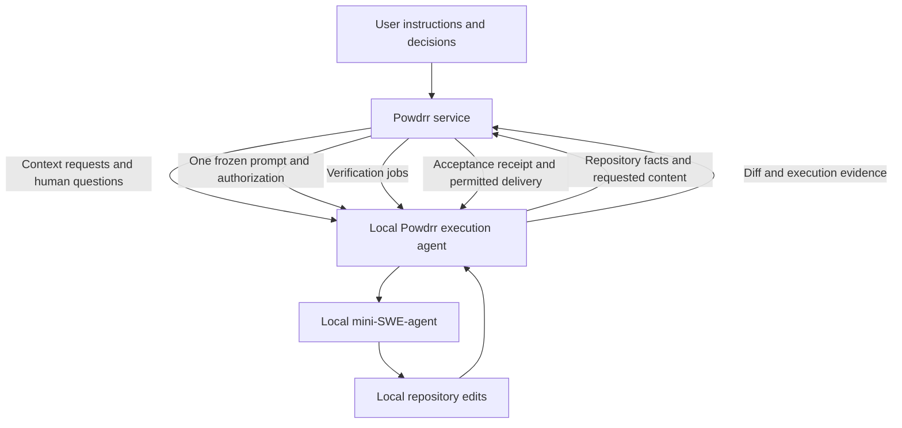

# Hosted Instruction Compiler and Local Execution Agent

Status: proposed architecture and implementation plan

## Purpose

Move Powdrr's sensitive instruction-to-prompt machinery into a service while
preserving local filesystem access and local mini-SWE-agent execution.

The service owns instruction interpretation, repository context selection,
semantic binding, design compilation, prompt assembly, workflow decisions, and
acceptance policy. A local execution agent supplies repository facts, displays
human questions, invokes mini-SWE-agent, executes verification, and performs
authorized Git delivery operations.

This is a proposed deployment architecture. It does not authorize deployment,
change existing product behavior, or claim that the service already exists.
Implementation should proceed through the independently reviewable changes
described below.

## Governing documents and current implementation

Preserve the semantic and execution guarantees in:

- [Source-anchored semantic contract compilation](../design/source-anchored-semantic-contract-compilation.md).
- [Single-prompt mini-SWE-agent boundary](../design/external-coding-agent-boundary.md).
- [Structrr, Procedrr, and Workrr integration](../design/structrr-procedrr-workrr-integration.md).
- [Bounded-LLM instruction compiler plan](bounded-llm-instruction-compiler.md),
  only for its still-normative source capture and atomic-clause production.

The deployment boundary must preserve those authorities: Structrr owns product
meaning and revisions, Procedrr owns bounded procedure semantics, and Workrr
coordinates execution and evidence. Hosting them does not grant Workrr the
right to reinterpret source intent or weaken completion gates.

The current repository has useful foundations, but the target handoff is not
fully implemented. `workrr/feature_endpoint.py` still constructs implementation
packets and execution units, supports provider alternatives, and has repair
paths. `workrr/coding_agent.py` already provides a local mini-SWE-agent adapter.
The service migration must finish the single-prompt boundary rather than expose
the existing execution-unit and repair behavior as a permanent network API.

## Goals and limits

The completed architecture must:

1. Remove proprietary compilation and planning machinery from the distributed
   local package.
2. Keep mini-SWE-agent invocation, repository edits, tool execution, and Git
   credentials local.
3. Compile every accepted design revision into exactly one immutable worker
   prompt and one private validation manifest.
4. Preserve source coverage, semantic faithfulness, repository binding,
   executable evidence requirements, and provenance across the network boundary.
5. Support durable runs, human interaction, cancellation, disconnection, and
   recovery without launching a second implementation attempt for the same run.
6. Keep repository transfer explicit, bounded, versioned, and subject to local
   disclosure policy.
7. Make both normal repository workflows and benchmark wrappers consume the
   same compiler and acceptance contracts.

The finished prompt necessarily reaches the local machine. It can be inspected
in memory, process arguments, local recordings, or mini-SWE-agent trajectories.
This architecture protects the machinery producing the prompt, its intermediate
decision prompts, proprietary workflow definitions, internal state, and
validation policy. It does not make the finished prompt secret from the person
controlling the machine executing it.

The service also cannot establish honest execution merely from client-supplied
test results. Hashes bind submitted artifacts together; signatures establish
service provenance. Neither proves that an arbitrary local machine executed a
command honestly. Initial acceptance explicitly trusts the authenticated local
agent's execution evidence. A future product requiring stronger guarantees needs
a separately designed controlled runner or attestation boundary.

## Architecture



Use a service with a public API, durable run storage, tenant-scoped artifact
storage, a work queue, and workers running the compiler and planning providers.
These can initially share one deployable application; separate services are not
required for each compiler phase.

The local package contains the CLI/TUI, transport client, repository adapters,
local policy enforcement, process supervision, evidence collection, and Git
delivery adapters. It connects outbound to the service; the service does not
require an inbound listener on a developer's machine.

## Ownership and IP boundary

| Area | Service owns | Local agent owns |
| --- | --- | --- |
| Instructions | Source ledger, segmentation, clause identities, dispositions | Submission of original text and local instructions |
| Semantic decisions | Classification, exact extraction, entailment, ambiguity handling, provider cascade | Human question display and answer submission |
| Repository understanding | Normalization, semantic indexing, candidates, ranking, population resolution, binding | File enumeration, raw syntax facts, Git state, permitted content reads |
| Design | Typed contracts, obligations, preservation rules, verification cases, completeness | Materialization of accepted customer-facing artifacts |
| Workflow | Proprietary definitions, static compilation, transitions, budgets, semantic retries | Execution of declared local operations and observation |
| Prompts | Context selection, token bounds, rendering, coverage checks | Exact prompt delivery to mini-SWE-agent |
| Implementation | Frozen authorization and attempt identity | Worktree preparation, one invocation, supervision, diff collection |
| Validation | Private manifest, evidence selection, probe generation, semantic judges, acceptance | Test collection, local probes, baseline worktrees, command execution |
| Delivery | Required gates and permitted delivery transition | Local commit, push, and PR operations with local credentials |

The local agent collects facts; the service decides their meaning and relevance.
Do not leave semantic heuristics in the client for convenience. In particular,
candidate ranking, obligation inference, context pruning, classifier examples,
entailment prompts, and accepted-design rendering belong in the service.

Generic language adapters may remain local when they only extract syntax facts
such as symbols, spans, references, or test collection. If an adapter contains
proprietary analysis, move that analysis into the service and upload the
permitted source needed to perform it. Inventory-only transfer cannot guarantee
that every instruction can be resolved; missing content must produce an explicit
request or unresolved outcome.

Planning model calls and any specialized semantic models execute in the service.
Calling them locally would distribute their prompts, schemas, orchestration, or
weights. The local mini-SWE-agent retains its separate coding-model connection
and credentials.

## Repository capture and context protocol

### Snapshot identity

Capture the actual starting repository state, not just a Git commit:

```yaml
schema_version: repository-snapshot-v1
repository_id: opaque-tenant-scoped-id
base_commit: exact-commit
tracked_tree_fingerprint: sha256:...
dirty_overlay_fingerprint: sha256:...
included_untracked_fingerprint: sha256:...
repository_instructions_fingerprint: sha256:...
adapter_revisions:
  - python-syntax-v1
disclosure_policy_revision: disclosure-policy-v1
snapshot_fingerprint: sha256:...
```

Specify canonical serialization, path normalization, byte encoding, and hashing
before implementation. Preserve original instruction and source bytes alongside
any parsed views. Dirty overlays include both staged and unstaged state where
their distinction affects execution; deleted files and relevant untracked files
must be represented explicitly.

A snapshot includes a bounded file manifest, local repository instructions,
applicable specifications, raw inventory, tool capabilities, and validation
configuration. Excluded content is represented as unavailable. Absence from an
upload must not be interpreted as proof that a file or subject does not exist.

Before implementation, the local agent compares the current state with the
handoff's expected snapshot and base commit. Drift invalidates the handoff.
The service must rebind and revalidate affected design inputs before issuing a
replacement handoff; it cannot silently bless the changed repository.

### Incremental transfer

Use content-addressed blobs and revision-bound requests. Upload a compact initial
manifest and required facts, then request additional source ranges, files,
specifications, or test information in batches. Reuse previously uploaded blobs
within the same tenant according to retention policy.

A context request identifies the run, request ID, expected snapshot, resource
paths or inventory references, requested coverage, and byte/count bounds. A
response identifies the supplied blobs and spans, content hashes, adapter
revision, coverage, omissions, and denial reasons.

Keep full-file hashes and precise spans for partial reads so the service can
associate an excerpt with the captured file. Content hashes are consistency
evidence supplied by the client, not independent proof of repository truth.

Context requests are structured reads. They cannot contain arbitrary shell
commands. Paths must be resolved against the allowed repository root with
symlink and traversal checks. Requests beyond local disclosure policy return
`denied` or `unavailable`; the service then asks for a permitted alternative or
reports unresolved design.

The client may inspect a broader local file manifest without transmitting every
file's contents. Disclosure policy must state whether paths, symbol names,
specifications, and test names are transferable as well as source bytes.

## Durable run protocol

### Public API

Use a small run-oriented API rather than one remote endpoint for each current
Python compiler function. The following routes are illustrative; the contract
semantics are required, while exact route names remain implementation choices.

| Operation | Example endpoint | Purpose |
| --- | --- | --- |
| Create run | `POST /v1/runs` | Submit instruction source, snapshot, capabilities, and policy |
| Upload blobs | `POST /v1/blobs` | Store permitted content and return verified content references |
| Read events | `GET /v1/runs/{id}/events?after={cursor}` | Resume ordered event delivery |
| Submit context | `POST /v1/runs/{id}/context-results` | Answer revision-bound repository requests |
| Submit human decision | `POST /v1/runs/{id}/decisions` | Bind an answer to a current question |
| Fetch handoff | `GET /v1/runs/{id}/handoff` | Retrieve the immutable prompt and authorization |
| Claim attempt | `POST /v1/runs/{id}/implementation-claim` | Assign one client ownership of the implementation attempt |
| Submit attempt | `POST /v1/runs/{id}/implementation-results` | Report terminal process state, trajectory references, and diff |
| Submit verification | `POST /v1/runs/{id}/verification-results` | Return local evidence for authorized verification jobs |
| Read result | `GET /v1/runs/{id}/result` | Obtain acceptance, failure, cancellation, or delivery state |
| Cancel | `POST /v1/runs/{id}/cancel` | Stop future work and request local process cancellation |

Events can be streamed or polled. Durable storage and cursor-based replay are
required regardless of transport. Events include context requests, human
questions, progress, handoff readiness, verification requests, and terminal
results. Public events expose decisions and actionable diagnostics without
shipping intermediate classifier prompts or proprietary procedure graphs.

Every mutating request carries an idempotency key and expected run revision.
Persist the request outcome atomically with its state transition. Reusing a key
with different content is a conflict. Duplicate identical evidence submissions
must not rerun semantic judges or consume another implementation authorization.

### State and authority

```text
created -> gathering_context -> compiling_design
                    ^                |
                    |                +-> awaiting_human -> compiling_design
                    +----------------+
compiling_design -> handoff_ready -> implementation_claimed
implementation_claimed -> implementing -> validating -> accepted
accepted -> delivering -> delivered
```

Design may request more context or human input within bounded procedure limits.
Any active phase may terminate as `failed` or `cancelled`. A lost implementation
agent produces an explicit `outcome_unknown` recovery condition; reconnecting
must reconcile the existing attempt before any subsequent action.

The service owns design and acceptance state. The client owns observations about
local execution. An agent's submission or zero process exit only returns control
for validation; it cannot set the run to `accepted` or `delivered`.

Acceptance and delivery remain distinct. A push or PR failure may be retried
with reconciliation of external Git state, without rerunning implementation.
Authorization to publish still depends on the user's workflow policy and local
repository requirements.

## Compilation and frozen handoff

The compiler follows the existing semantic design:

1. Capture the immutable original instruction and compile atomic clauses.
2. Resolve source-anchored classifications and exact extractions.
3. Validate field entailment and retain unresolved results explicitly.
4. Retrieve repository and ontology candidates from versioned context.
5. Bind subjects through bounded candidate decisions.
6. Assemble typed contracts, verification cases, and preservation constraints.
7. Compare contracts sharing a subject to preserve lifecycle, observation,
   precedence, and boundary distinctions.
8. Prove source coverage and readiness of every actionable contract.
9. Atomically compile the prompt and private validation manifest.

All identities, references, fingerprints, control flow, and completion
predicates remain compiler-owned. Planning providers return only permitted
semantic results. No network adapter may relax those response boundaries.

The handoff contains:

- Run, design, prompt, and attempt identities.
- Exact rendered prompt and its fingerprint.
- Expected repository snapshot and base commit.
- Allowed durable and ephemeral paths and focused command contracts.
- Wall, process, and model budgets where enforceable.
- Compiler, rendering, policy, workflow, and protocol revisions.
- A manifest fingerprint and prompt-completeness receipt.
- A service signature over the complete authorization envelope.

The manifest stays in service storage. Prompt and manifest must share one design
revision, source set, repository binding, verification set, and reciprocal
fingerprints. Every actionable obligation appears in both artifacts. One-sided
compilation or a coverage failure prevents handoff readiness.

The worker-facing prompt retains the eight sections in the single-prompt design:
Objective, Repository starting point, Required behavior, Required verification,
Preserve and avoid, Allowed scope, Focused commands, and Completion protocol.
The client must not prepend guidance, append repair instructions, summarize the
prompt, or regenerate it locally. mini-SWE-agent's own normal agent configuration
is recorded separately; the Powdrr task prompt remains byte-identical.

Signed handoffs use versioned canonical encoding, key IDs, audience binding,
and a documented key-rotation policy. Local checks still verify the envelope
against local scope and user authority. A valid signature does not grant the
service arbitrary filesystem or shell access.

## Local execution, interruption, and recovery

The client verifies authorization, protocol support, local permissions, current
snapshot, budgets, and absence of an earlier invocation. It acquires the service
claim, then writes a durable local attempt journal before spawning mini-SWE-agent
in the dedicated implementation worktree.

The journal records attempt identity, prompt hash, starting snapshot, invocation
intent, process identity when available, trajectory location, and terminal state.
Run artifacts live outside the candidate checkout. Process monitoring collects
progress without injecting instructions into mini-SWE-agent.

Do not promise exactly-once process spawning across a crash. A crash between
writing invocation intent and recording the spawned process may leave an
uncertain outcome. In that case, reconcile process identity, trajectory, journal,
and repository state. If evidence cannot prove what happened, terminate the run
with an explicit uncertainty diagnostic rather than launch again.

A service claim expiry must not authorize another client to spawn the same
attempt. Claims fence concurrent clients, but lease expiry alone does not prove
that a local process stopped. Implementation identity remains consumed until
its outcome is reconciled; a terminal failure requires a new run to retry coding.

Once a valid frozen handoff has been acquired and the attempt claimed, local
implementation may continue through a service interruption. Queue observations
and upload them after reconnecting. New design work, new verification jobs, final
acceptance, and publication requiring service authorization wait for recovery.
Already authorized verification jobs may complete locally and queue evidence.

Cancellation sets a durable service state and asks the connected client to stop
the process. A disconnected client cannot receive immediate cancellation; local
budgets bound that exposure. Preserve partial changes and evidence, and never
describe a service cancellation request as proof that the local process ended.

mini-SWE-agent is invoked once per implementation run. Provider failure, budget
exhaustion, invalid changes, or failed validation are terminal. A subsequent
attempt needs a new run identity and a current revalidated design. There is no
in-run continuation, alternate coding provider, or validation-derived repair
prompt.

## Validation and delivery

Keeping acceptance in the service protects verification policy and preserves a
single authority for completion. The private manifest drives typed verification
jobs, each bound to the attempt, candidate fingerprint, baseline, obligation
references, adapter revision, command policy, and evidence requirements.

Local operations collect and execute the actual tests, run required formatter,
lint, type, and full-test profiles, create isolated baseline worktrees, and
execute authorized probes. Results include collection status, exit status,
stdout/stderr references, relevant source hashes, environment and tool revisions,
candidate identity, and baseline identity. Results distinguish skipped, xfailed,
deselected, missing, ambiguous, and executed targets.

The service performs obligation coverage, scope analysis, oracle alignment,
source/diff selection, bounded semantic judgments, and final evidence
aggregation. Candidate-pass/baseline-fail discrimination and reviewed alternative
evidence strategies follow the existing single-prompt design. Every required
receipt must pass; averaging verdicts is forbidden.

Independent probe code may be generated in the service and delivered as a
bounded local job outside the candidate checkout. This keeps probes out of the
coding agent's ordinary inputs, but does not make them secret or inaccessible to
the machine owner. Actual isolation from mini-SWE-agent requires enforced process
and filesystem permissions; path placement alone is insufficient.

The client keeps a minimal independent enforcement layer: repository containment,
user-approved capabilities, safe command matching, process limits, credential
separation, and immutable-prompt checks. Acceptance heuristics stay in the
service. Authorization jobs use explicit executable, arguments, working
directory, and environment contracts rather than unrestricted shell strings.

Bind the final acceptance receipt to the final candidate diff and tree state.
Recheck those hashes immediately before delivery. Changes after validation
invalidate acceptance and require fresh evidence. Delivery adapters reconcile
existing commits, branches, pushes, and PRs so a lost response does not create
duplicate publications.

Git and coding-model credentials stay local. Planning-provider credentials stay
in the service. Give mini-SWE-agent only the coding credentials and local access
needed for the implementation; it must not receive the service token, private
manifest, run-artifact access, or publication credentials.

## Packaging, artifacts, and privacy

### Package separation

Use three logical components, without requiring three repositories initially:

1. A public contracts package containing serializable protocol types and
   validation of their structure.
2. A distributed local agent containing repository adapters, transport, UI,
   execution, enforcement, evidence, and delivery.
3. A private service package containing compilation, semantic providers,
   proprietary workflow definitions, context selection, and acceptance policy.

Split mixed modules before moving them. `core/repository_inventory.py` combines
filesystem inspection with lookup and candidate aggregation.
`workrr/command_catalog.py` combines deterministic operations with artifact writes
and mutable runtime state. `workrr/feature_endpoint.py` combines planning,
implementation, validation, and delivery. These should become explicit adapters
around typed inputs and outputs rather than remote methods accessing local
`Path` objects or shared Python dictionaries.

Extract proprietary workflow and classifier assets as well as code. Audit
wheel/sdist contents, packaged data, examples, optional extras, container images,
debug endpoints, and source maps. The current build includes Procedrr modules
and packaged skill definitions; the future distribution needs an explicit
allowlist. A local compiler fallback would continue distributing the protected
machinery and is excluded from the final local package.

### Artifact visibility

| Artifact | Storage and exposure |
| --- | --- |
| Original instructions and disclosed repository content | Tenant-scoped service storage and local source |
| Internal semantic decisions, classifier prompts, procedure state | Service only; limited operational access |
| Accepted customer specifications and changelogs | Exportable and materializable in the repository |
| Finished implementation prompt and handoff receipt | Service and local client; visible to the user |
| Private validation manifest | Service only; client receives required individual jobs |
| Local journal, trajectory, command evidence | Outside candidate checkout; permitted uploads to service |
| Acceptance/failure receipts and actionable diagnostics | Service and client; exportable for review |

Privacy controls cover paths and metadata as well as file contents. Define
upload exclusions, tenant access, retention, deletion, encrypted transport and
storage, operational audit, and permitted provider destinations. Do not silently
redact semantic source: record exclusions and request clarification when omitted
content prevents faithful compilation. Never use customer repository content for
model training without an explicit separate agreement.

Do not log source text, prompts, credentials, or full command output by default
in general service logs. Detailed artifacts are separately access-controlled.
Tenant ownership must be checked for every blob and artifact reference;
cross-tenant hash-based deduplication must not reveal content existence.

Signed receipts and retained artifacts need explicit retention semantics. If a
customer deletes the design or evidence, later replay or acceptance verification
may become unavailable; report that limitation rather than reconstruct records
from guesses.

### Deployment options

The initial product is a hosted service. Customers prohibiting repository
transfer need a private compiler deployment inside their environment. That is a
separate distribution and commercial boundary: shipping the service's executable
code to the customer changes the IP exposure. It is not equivalent to keeping
all compiler machinery exclusively in Powdrr-operated infrastructure.

Private deployment, offline compilation, customer-managed planning providers,
and stronger execution attestation are explicit later product decisions. The
initial local client supports completing an already authorized implementation
through disconnection, but cannot create a new design offline.

## Operations and versioning

Pin each run to compiler, renderer, workflow, ontology, provider/model,
repository-adapter, and policy revisions. A service deployment must not silently
change a run's meaning. Persist model outputs and bound decisions for replay;
replay uses recorded decisions rather than assuming a model will return the
same result twice.

Negotiate protocol and capability support before starting work. Old clients may
finish compatible frozen runs, but unsupported operation types or required
guarantees prevent new handoffs. Schema migration may preserve old readers;
it must not reinterpret old accepted semantic contracts in place.

Start with durable run metadata, transactional transitions, tenant-scoped blob
storage, and queue workers. Bound source size, inventory size, upload bytes,
clauses, semantic activations, retries, prompt size, execution time, and artifact
retention. Exhaustion produces a typed diagnostic and retained partial state.

Measure design latency, context-transfer latency and bytes, cache reuse, planning
cost, decisions per clause, unresolved bindings, compilation failure stage,
implementation duration, validation duration, reconnect frequency, and unknown
attempt outcomes. Keep network exchanges at context or execution boundaries;
many small semantic decisions remain internal to a service worker.

Operational cost includes planning inference, semantic indexing, repository
content storage, evidence storage, network transfer, and service support.
Coding-model costs remain local under the initial credential model. Obtain
representative measurements before making latency or cost commitments.

## Implementation sequence

Each stage is a separate reviewed change set with an executable exit gate.
Intermediate extraction can retain the existing local production path during
development. The released service-backed client must remove the proprietary
local fallback and pass the distribution audit before the migration is complete.

### Stage 1: Extract compiler contracts and state boundaries

- Introduce explicit instruction, snapshot, context, design, handoff, attempt,
  evidence, and receipt interfaces.
- Separate pure compilation from filesystem persistence and local operations.
- Split raw language inspection from semantic inventory lookup and ranking.
- Inventory proprietary code, assets, workflow definitions, and shipped data.

Exit gate: deterministic fixtures run through the extracted compiler with
serialized inputs, and the compiler requires no direct local repository paths.
Record every remaining mixed responsibility in a migration checklist.

### Stage 2: Complete the single-prompt compiler and local consumer

- Compile prompt and manifest atomically from one accepted design.
- Enforce source coverage, prompt completeness, and reciprocal fingerprints.
- Replace implementation-unit dispatch and repair behavior in the migrated flow
  with one mini-SWE-agent invocation.
- Add durable attempt journaling, immutable task-prompt checks, and terminal
  failure semantics.

Exit gate: an end-to-end fixture produces one complete handoff and invokes the
local mini-SWE-agent adapter once. Missing obligations, stale inputs, or manifest
mismatch prevent invocation. Failed validation never produces another prompt.

### Stage 3: Host the compiler behind the durable run API

- Implement authentication, run storage, blob ownership, events, idempotency,
  capability negotiation, and worker execution.
- Move planning-provider calls and semantic decision assets into service workers.
- Add a transport adapter to the local client using the same compiler contracts.
- Support human questions and bounded context requests through the existing UI.

Exit gate: the same deterministic instruction fixture traverses the service API
and produces the same semantic artifacts and rendered prompt as the extracted
compiler using identical recorded decisions.

### Stage 4: Move workflow control and acceptance into the service

- Move proprietary procedure definitions, workflow transitions, context
  selection, budgets, and completion predicates into service storage/workers.
- Keep the private manifest remotely and emit typed local verification jobs.
- Implement evidence binding, baseline comparison, semantic review, acceptance,
  and delivery receipts.
- Preserve local permissions and customer-facing specification export.

Exit gate: a service-backed run progresses from instruction through one local
implementation attempt to accepted or failed evidence and authorized delivery.
The local package needs no semantic compiler or proprietary workflow source.

### Stage 5: Harden recovery and remove proprietary distribution

- Exercise multi-client claims, local crashes, disconnections, cancellation,
  version changes, and delivery-response loss.
- Remove compilation modules, assets, optional fallback dependencies, and
  internal artifacts from the local wheel and source distribution.
- Audit logs, debug surfaces, tenant access, disclosure policy, and retention.
- Run the normal repository and benchmark wrappers against the same service
  contracts and preserve benchmark process/artifact boundaries.

Exit gate: the published client passes the package audit and recovery matrix;
representative full runs preserve semantic coverage, one invocation, evidence
integrity, and reviewable delivery.

## Required validation for implementation

Future implementation PRs must include the following coverage in addition to
the repository's full formatter, lint, type, workflow, scenario, and test suite.

| Area | Required cases |
| --- | --- |
| Semantic preservation | Every source proposition has a disposition; modifiers, exceptions, and preservation rules reach prompt and evidence |
| Compiler parity | Identical captured inputs and recorded decisions produce equivalent local-extraction and service artifacts |
| Snapshot integrity | Staged/unstaged changes, deletions, untracked files, local instruction drift, stale excerpts |
| Handoff integrity | Tampered prompt, bad signature, wrong audience, manifest mismatch, missing coverage, unsupported revisions |
| Protocol recovery | Duplicate submissions, reused key with different body, reordered events, cursor replay, worker crash |
| Invocation safety | Crash before spawn, crash after spawn, missing trajectory, concurrent clients, expired claim, disconnected process |
| Validation | Missing/skipped/xfailed targets, unrelated passing tests, weakened oracle, stale evidence, baseline discrimination |
| Permissions | Traversal, symlink escape, denied disclosure, unsafe commands, run-artifact access, credential separation |
| Acceptance and delivery | Candidate change after acceptance, lost push/PR response, duplicate delivery, revoked authorization |
| Data isolation | Foreign tenant blob IDs, content-existence leakage, retention expiry, deletion, sensitive logging |
| Distribution | No compiler code, classifier assets, proprietary procedures, or fallback implementation in local artifacts |

Use deterministic provider fixtures for routine parity and recovery tests.
Explicitly opt-in live-provider tests measure semantic behavior and cost; they
must not replace structural and adversarial checks. Benchmark verification must
evaluate the real local mini-SWE-agent patch and retain the service receipts and
local attempt evidence on both success and failure.

## Decisions needed before production rollout

The architecture above provides the default ownership boundary. Resolve these
product and operational choices before releasing it:

- Initial disclosure defaults and retention periods for source, prompts,
  trajectories, and evidence.
- Whether private deployments are offered and what code/artifact access they
  entail.
- Supported coding-provider credential model and customer planning-provider
  configuration.
- Compatibility lifetime for frozen runs and service signing keys.
- Acceptable service latency, availability, data residency, and cost based on
  measured workloads.
- Whether trusting authenticated local execution evidence satisfies the
  product's acceptance claims.

Do not block contract extraction on deployment-provider selection. The first
implementation work is to separate compiler inputs, semantic computation, local
operations, and durable outputs. That makes the proposed boundary concrete and
reviewable before committing to production infrastructure.
